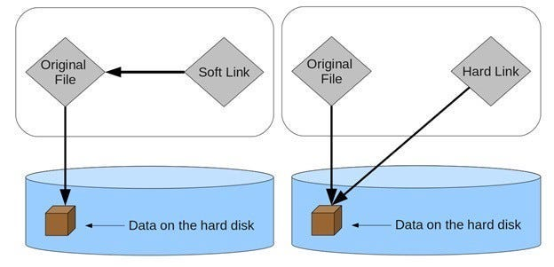
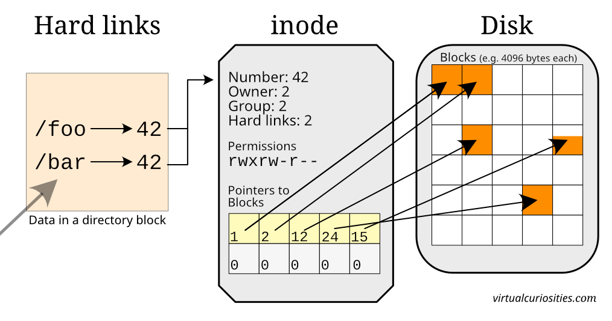

# Linux Links: Hard Links and Symbolic (Soft) Links

## 1. Background: How files really work in Linux

In Linux, a **file name is not the file itself**.

- The actual file is represented by an **inode**
- An inode stores:
  - permissions
  - owner
  - size
  - timestamps
  - pointers to data blocks

- A **directory** is just a mapping:

  ```
  filename → inode number
  ```

This design allows **multiple filenames to point to the same inode**, which is the foundation of links.

---

## 2. Types of links in Linux

Linux supports **two types of links**:

1. **Hard link**
2. **Symbolic link**
   (also called **soft link** or **symlink** — all mean the same thing)

---

## 3. Hard Links





### 3.1 What is a hard link?

A **hard link** is:

> Another directory entry pointing to the **same inode**

- Same inode number
- Same data
- Same permissions
- No concept of “original” vs “copy”

---

### 3.2 Creating a hard link

```bash
ln original.txt hardlink.txt
```

Check inode numbers:

```bash
ls -li
```

Example:

```text
123456 -rw-r--r-- 2 user user 20 original.txt
123456 -rw-r--r-- 2 user user 20 hardlink.txt
```

- Both names point to inode `123456`
- Link count = 2

---

### 3.3 Behavior of hard links

**Modify one → affects all**

```bash
echo "data" >> original.txt
cat hardlink.txt
```

**Delete one → file still exists**

```bash
rm original.txt
cat hardlink.txt
```

The inode is removed **only when link count becomes zero**.

---

### 3.4 Limitations of hard links

Hard links:

- cannot link directories
- cannot cross filesystems
- cannot point to non-existing files

---

### 3.5 Use cases for hard links

- Saving disk space
- Package managers
- Backup systems
- Atomic file updates

---

## 4. Symbolic Links (Soft Links / Symlinks)

### 4.1 What is a symbolic link?

A **symbolic link** is:

> A special file that stores a **path** to another file or directory

- Has its **own inode**
- Stores text: the target path
- Works like a redirect

---

### 4.2 Creating a symbolic link

```bash
ln -s target.txt link.txt
```

Check:

```bash
ls -l
```

Example:

```text
lrwxrwxrwx 1 user user 10 link.txt -> target.txt
```

- `l` → symbolic link
- `->` → points to target path

---

### 4.3 Symlinks to directories

```bash
ln -s /var/log logs
cd logs
```

Symbolic links **can point to directories**, unlike hard links.

---

### 4.4 Absolute vs Relative symlinks

**Absolute symlink**

```bash
ln -s /home/user/file.txt link.txt
```

- Breaks if directory structure moves

**Relative symlink (recommended)**

```bash
ln -s ../file.txt link.txt
```

- Portable
- Survives directory relocation

---

### 4.5 Broken (dangling) symlinks

If the target is deleted:

```bash
rm target.txt
cat link.txt
```

Result:

```text
No such file or directory
```

Find broken symlinks:

```bash
find . -xtype l
```

---

### 4.6 Fixing a symlink

```bash
ln -sf new_target.txt link.txt
```

Options:

- `-s` → symbolic
- `-f` → overwrite existing link

---

### 4.7 Deleting symlinks (important safety rule)

Correct:

```bash
rm link.txt
```

Dangerous:

```bash
rm link.txt/
```

This may delete the **target directory contents**.

**Rule:**
Never add `/` when deleting symlinks.

---

### 4.8 Symlink permissions

Symlink permissions always appear as:

```text
lrwxrwxrwx
```

They are **ignored**.

Actual access depends on:

- permissions of the **target**
- permissions of parent directories

---

## 5. Hard Link vs Symbolic Link (Comparison)

| Feature                  | Hard Link | Symbolic Link |
| ------------------------ | --------- | ------------- |
| Points to inode          | Yes       | No            |
| Has own inode            | No        | Yes           |
| Stores path              | No        | Yes           |
| Can cross filesystem     | No        | Yes           |
| Can link directories     | No        | Yes           |
| Survives target deletion | Yes       | No            |
| Can be broken            | No        | Yes           |

---

## 6. Real-world usage examples

### System binaries

```text
/bin/sh -> dash
```

### Version switching

```bash
python -> python3.12
```

### Dotfiles

```bash
~/.vimrc -> ~/dotfiles/.vimrc
```

### Zero-downtime deployments

```text
current -> release_2026_01
```

---

## 7. Mental model (summary)

- **Hard link**
  → Same file, same inode, different name

- **Symbolic (soft / sim) link**
  → File that points to a path

If the inode exists → hard link works
If the path exists → symlink works

---
